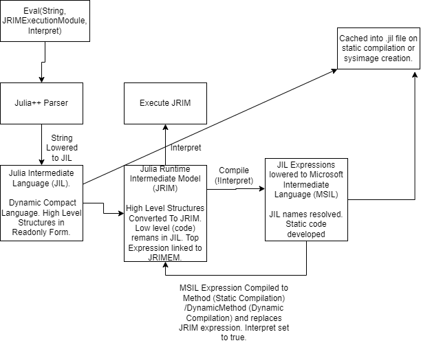

# juliapp
.NET Runtime for Julia++
VERY EXPERIMENTAL, MOSTLY NOT FUNCTIONAL AT THE MOMENT!
Designed to implement julia into .NET. Will translate julia into JIL (Julia Intermediate) which will then lower to IL or Machine Code on type specialization

# Resources
* [.NET 6](https://dotnet.microsoft.com/en-us/learn/dotnet/what-is-dotnet ".NET6 Documentation Link") (Statically Typed): Runtime, Code Generation & Execution Platform 
   * [Common Intermediate Language (CIL)](https://en.wikipedia.org/wiki/Common_Intermediate_Language "CIL Documentation Link"): JRM lowered to CIL on compilation.
* [ANTLR4](https://www.antlr.org/ "Antlr Link"): Parser, Lexer & AST Walker
* [Julia](https://julialang.org/ "Julia Link"): (Dynamically Typed): Base Language used by Julia++

# Language Project
* [Julia++ Runtime](runtime "Julia++ Runtime Link"): Required to run Julia++ Code. Contains the parser, JIL compiler and other tools that dynamically link together the program during runtime. 

  * [Julia++ Grammer](runtime/parse/generated/Julia.g4 "Julia++ Grammer Link"): The grammar defines the structure of the language and when compiled to code with ANTLR, will generate a parser, lexer and AST walker that will be used by the Julia++ Static Compiler to Julia Intermediate Language (JIL) I am currently working on making it Julia Compatible before adding my own extensions.

  * Dynamic Code Model. Used to represent the Julia++ in a compact form

  * [Julia++ Intermediate Language (JIL)](runtime/core/JIL "JIL Link"). Stack-based dynamic code form that contains name references rather than static typing. The name references point to a predetermined location that is analogous to a global variable that can be rewritten through the lifespan of the program. JIL cannot be directly executed as it is meant to be read-only and compact.

  * [Julia++ Runtime Model](runtime/core/Runtime "JRM Link"). Converts JIL to JRM. The JRM can be directly interpreted using the [JIL Interpreter](runtime/core/JIL/Interpreter.cs "JIL Interpreter Link") or lowered to CIL using the [JIL Compiler](runtime/core/JIL/Compiler.cs "JIL Compiler Link"). 

  * [ILCompiler](runtime/ILCompiler, "ILCompiler Link"). Used by the JIL Compiler to generate IL code.

* [Testing](test "Testing Link"). Where the Julia++ Runtime is tested to make sure it is valid.

* [Julia Standard Library (JSL)](base "JSL Link"). During Runtime Compilation, the JSL will be compiled to JIL and compacted into a jstl.cjpp file that contains the code model of the JSL and precompiles various methods to speed up runtime execution.

* [Julia++ Standard Library (PSTL)](stlib "PSTL Link"). Extension of the JSL for the Julia++ Language

# Work Plan
* JIL, JRM, JIL Interpreter (Currently Working On). Create JRM of basic program(s) that is able to be successfully interpreted

* JIL Compiler.  Create JRM of basic program(s) that is able to be successfully compiled.
Julia Grammer. Make it Julia v1.9 Compatible and be able to lower to JIL.

* JIL Dynamic Compiler & Julia Expr Lib. (Julia contains macros that essentially insert code during parsing, this will be an extension of the JIL Static Compiler).

* JIL serializer to .cjpp files

* Julia STL Modification. The JSL will need to be modified in order to make it work in the new environment

* Survey Math, Physics & CS Faculty about features they would like to see in a language

* Julia++ Grammer. Extend the Julia Grammer to custom features

* Julia++ Standard Library. Creation of the Julia++ STL. 

# Evaluation Pipeline

