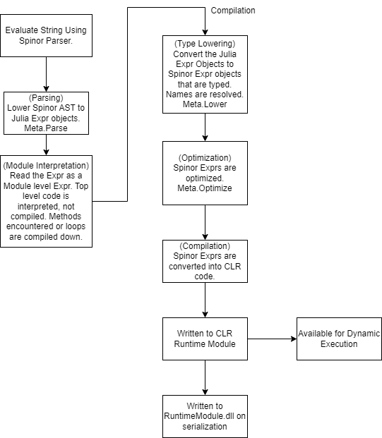

# Spinor
.NET Runtime for Julia

# Resources
* [.NET 6](https://dotnet.microsoft.com/en-us/learn/dotnet/what-is-dotnet ".NET6 Documentation Link") (Statically Typed): Runtime, Code Generation & Execution Platform 
   * [Common Intermediate Language (CIL)](https://en.wikipedia.org/wiki/Common_Intermediate_Language "CIL Documentation Link"): JRM lowered to CIL on compilation.
* [ANTLR4](https://www.antlr.org/ "Antlr Link"): Parser, Lexer & AST Walker
* [Julia](https://julialang.org/ "Julia Link"): (Dynamically Typed): Base Language used by Julia++

# Language Project
* [Spinor Runtime](runtime "Spinor Runtime Link"): Required to run Julia++ Code. Contains the parser, JIL compiler and other tools that dynamically link together the program during runtime. 

  * [Spinor Grammer](runtime/parse/generated/Spinor.g4 "Spinor Grammer Link"): The grammar defines the structure of the language and when compiled to code with ANTLR, will generate a parser, lexer and AST walker that will be used by the Spinor Compiler.

  * [ILCompiler](runtime/ILCompiler, "ILCompiler Link"). Used by the Spinor Compiler to generate IL code.

* [Testing](test "Testing Link"). Where the Spinor Runtime is tested to make sure it is valid.

* [Julia Standard Library (JSL)](https://github.com/JuliaLang/julia/tree/master/base "JSL Link"). During Runtime Compilation, the JSL will be compiled to JIL and compacted into a jstl.cjpp file that contains the code model of the JSL and precompiles various methods to speed up runtime execution.

* [Spinor Standard Library (SSTL)](stlib "SSTL Link"). Extension of the JSL for the Spinor Language

# Work Plan
* Type Lowering & Compilation of Expr objects into CLR

* Expr Compiler.  Create JRM of basic program(s) that is able to be successfully compiled.
Julia Grammer. Make it Julia v1.9 Compatible and be able to lower to CLR.

* Julia STL Modification. The JSL will need to be modified in order to make it work in the new environment

* Survey Math, Physics & CS Faculty about features they would like to see in a language

* Spinor Grammer. Extend the Julia Grammer to custom features

* Spinor Standard Library. Creation of the Julia++ STL. 

# Evaluation Pipeline

